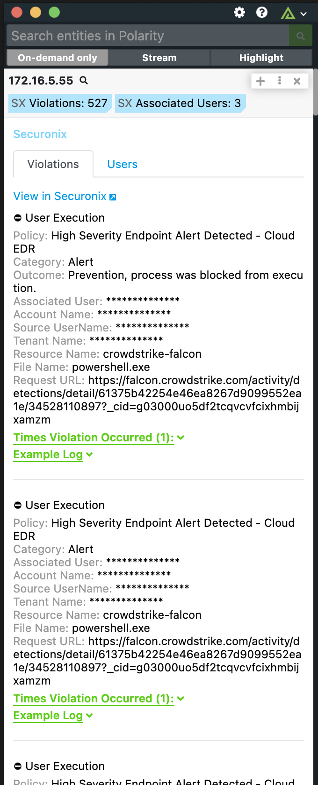

# Polarity Securonix Integration

Securonix is a platform that delivers a next generation security analytics and operations management platform for the modern era of big data and advanced cyber threats.

The Polarity Securonix integration allows Polarity to search the Securonix API to return User Violation and Activity (Event) information on Emails, Domains, and IPs as well as Custom Hostnames and Usernames defined by the user.

  

To learn more about Securonix please see their official website at [https://www.securonix.com/products/platform-overview/](https://www.securonix.com/products/platform-overview/)

## Securonix Integration Options

### URL

The URL for your Securonix API server which should include the schema (i.e., http, https) and port if required.  For example `https://server-instance.securonix.net`

> Note that the API server value cannot end with a trailing `/`.

### Username

Valid Securonix Username

### Password

Password for the provided Securonix username

### Search Categories

Select one or more categories to search:

* Violations
* TPI
* Users
* Risk Score
* Activity (Events)

### Violation Days Back
The number of days you would like to look back for violations. Supports fractional days (e.g., 0.25 would be 8 hours).

### Activity (Events) Days Back
The number of days you would like to look back for activity (events). Supports fractional days (e.g., 0.25 would be 8 hours).  It is not recommended to search back more than 7 days.

### Activity Search Filter

A filter you would like to apply to the Activity search.  For example, it's recommended to filter by "resourcegroupname" in which case the Activity Search Filter value would be `resourcegroupname="my_resource_group"`.

## Polarity

Polarity is a memory-augmentation platform that improves and accelerates analyst decision making.  For more information about the Polarity platform please see:

https://polarity.io/